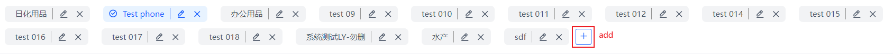
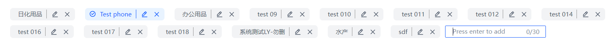
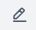
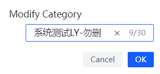
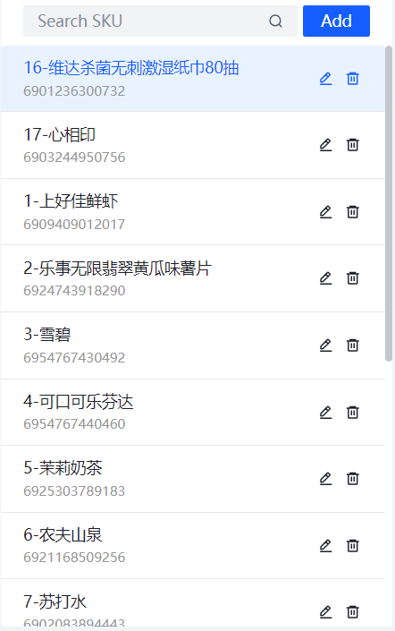
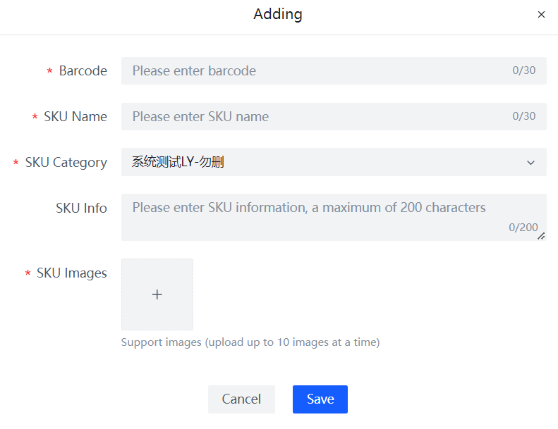
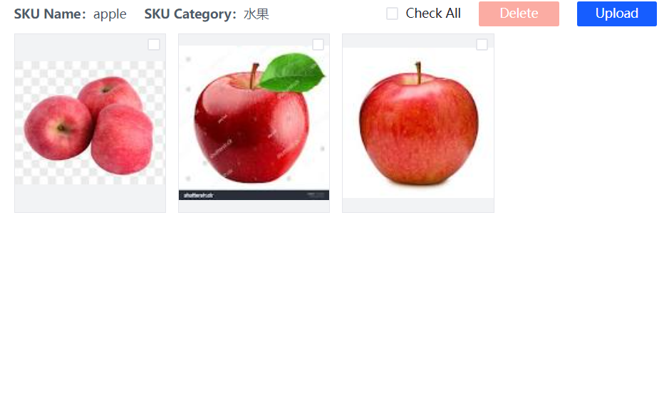
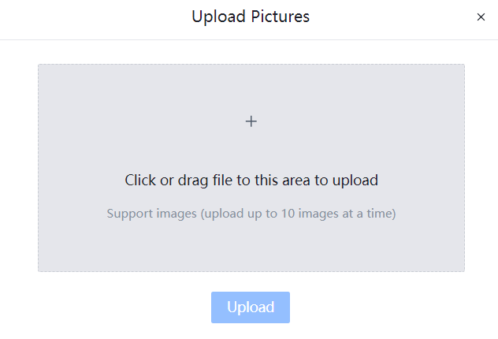
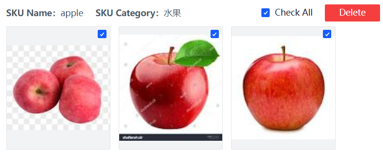
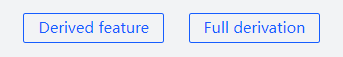

# SKU Admin

## SKU Category

### New Category
Click the "+" button in the category area, enter the category name, press the keyboard **Enter key** to complete the addition, after the successful addition, the new category will be displayed in the list.

The value contains a maximum of 30 characters.

### Modify Category
Click icon, modify the category name in the input box in the pop-up window, click the confirm button to complete the modification.

### Delete category
Click icon, pop-up window to confirm deletion, click Confirm deletion, complete deletion, refresh the category list.
**If an SKU exists in the category, it cannot be deleted.**

## SKU

In the SKU category area, click to select a category. In the SKU list area, SKUs under the corresponding category are displayed.
The data in the list shows the SKU name in large font, and the barcode in small font below the SKU name.

### Search SKU
Enter the SKU name or barcode in the search box for data query.

### New SKU
Click Add button, enter SKU information in the pop-up form, upload SKU picture, click Save, the system will automatically extract SKU features.

### Modify SKU
Click icon, modify SKU information in the form.

### Deleting SKU
Click icon to delete。

## SKU Images

The image area displays images from the selected SKU, which are uploaded when the SKU is created, or via the Upload button in the image area.

### Upload Images
Click Upload button, in the pop-up window, select the image, click Upload, wait for the progress bar to end.

### Deleting Images
Select the image to be deleted from the checkbox and click the Delete button to confirm the deletion.

### Derived Eigenvalue
Click the Export button at the bottom of the page to export the extracted eigenvalues. You can choose to export the eigenvalues of the current SKU or fully export the eigenvalues of all SKUs.

  