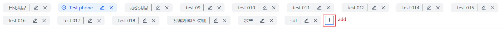
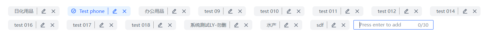
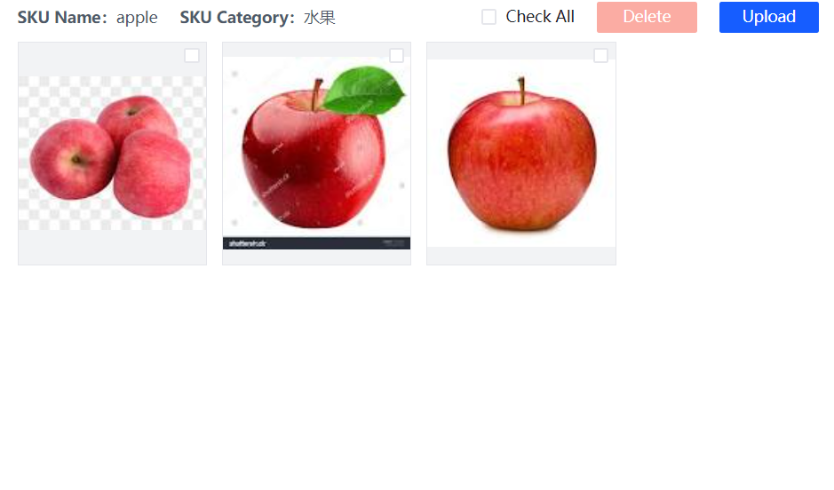

# SKU管理

## SKU类别

### 新增类别
在类别区域点击“+”按钮，输入类别名称，按键盘**回车键**完成添加，添加成功后，新的类别显示在列表中。

输入长度不超过30个字符。

### 修改类别
点击需要修改的类别中的图标，在弹窗中的输入框中修改类别名称,点击确认按钮完成修改。

### 删除类别
点击需要删除的类别中的图标，弹窗确认删除，点击确认删除,完成删除，刷新类别列表。
**如果类别中存在SKU，无法进行删除。**

## SKU

在SKU类别区域点击选择类别，SKU列表区域展示对应类别下的SKU。
列表中的数据以大号字体展示SKU名称，SKU名称下方的小号字体展示条形码。

### SKU搜索
在搜索框中输入SKU名称或者条形码进行数据查询。

### 添加SKU
点击添加按钮，在弹出的表单中输入SKU信息，上传SKU图片，点击保存，系统会自动提取SKU特征。

### 修改SKU
点击SKU列表中的图标，在表单中修改SKU信息。

### 删除SKU
点击SKU列表中的图标进行删除。

## SKU图片

图片区域展示了选择的SKU中的图片，图片在创建SKU的时候进行上传，或者通过图片区域的上传按钮进行上传。

### 上传图片
点击上传按钮，在弹窗中，选择图片，点击上传，等待进度条结束。

### 删除图片
通过checkbox选择需要删除的图片，点击删除按钮，确认删除。

### 导出特征值
点击页面下方的导出按钮导出提取的特征值，可以选择导出当前SKU的特征值或者全量导出所有SKU的特征值。

  